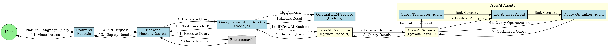

# CrewAI Integration for Log Analysis Application

## Overview

This document describes the integration of CrewAI, a Python framework for orchestrating role-playing AI agents, into the Log Analysis Application. The integration enhances the natural language query translation capabilities by leveraging specialized AI agents working together to produce more accurate and optimized Elasticsearch queries.

## Architecture

The CrewAI integration consists of the following components:

1. **Python CrewAI Service**: A FastAPI application that uses CrewAI to translate natural language queries into Elasticsearch DSL.
2. **Connector Service**: A bridge between the Node.js backend and the Python CrewAI service.
3. **Node.js Integration**: Updates to the existing LLM service to use the CrewAI service with fallback capabilities.



## CrewAI Agents

The CrewAI service uses three specialized agents:

1. **Elasticsearch Query Translator**: Translates natural language into Elasticsearch DSL queries.
2. **Log Analysis Expert**: Analyzes log patterns and provides context for queries.
3. **Query Optimizer**: Optimizes Elasticsearch queries for performance and accuracy.

These agents work together in a sequential process to understand, translate, and optimize queries.

## Setup and Configuration

### Prerequisites

- Python 3.10+
- Node.js 14+
- OpenAI API key

### Installation

1. Install Python dependencies:
   ```bash
   cd backend/python_services/crewai_service
   pip install -r requirements.txt
   ```

2. Set environment variables:
   ```bash
   export OPENAI_API_KEY="your-api-key-here"
   export CREWAI_SERVICE_URL="http://localhost:8000"
   export CREWAI_CONNECTOR_URL="http://localhost:8001"
   ```

3. Start the CrewAI services:
   ```bash
   cd backend/python_services/crewai_service
   chmod +x start_services.sh
   ./start_services.sh
   ```

4. Enable CrewAI in the Node.js backend:
   ```bash
   export USE_CREWAI="true"
   ```

## API Reference

### CrewAI Service API

#### POST /translate-query

Translates a natural language query into an Elasticsearch DSL query.

**Request:**
```json
{
  "natural_language_query": "Show me all error logs from the payment service in the last 24 hours",
  "index_pattern": "logs-*",
  "time_range": {
    "gte": "now-24h",
    "lte": "now"
  },
  "additional_context": {
    "common_services": ["payment", "auth", "user", "order"]
  }
}
```

**Response:**
```json
{
  "elasticsearch_query": {
    "bool": {
      "must": [
        {
          "range": {
            "@timestamp": {
              "gte": "now-24h",
              "lte": "now"
            }
          }
        },
        {
          "match": {
            "level": "ERROR"
          }
        },
        {
          "match": {
            "service": "payment"
          }
        }
      ]
    }
  },
  "explanation": "This query filters logs from the payment service with ERROR level from the last 24 hours.",
  "confidence_score": 0.95
}
```

### Connector Service API

#### POST /proxy-query

Proxies requests to the CrewAI service and returns the response.

**Request/Response**: Same as the CrewAI Service API.

## Integration with Existing LLM Service

The integration with the existing LLM service is handled by the `query-translation.service.js` file. This service:

1. Checks if CrewAI is enabled via the `USE_CREWAI` environment variable.
2. If enabled, attempts to use the CrewAI service for query translation.
3. If the CrewAI service is unavailable or returns an error, falls back to the original LLM service.

## Testing

A test script is provided to verify the CrewAI integration:

```bash
cd backend/src
node tests/test-crewai-integration.js
```

The test script:
1. Tests multiple natural language queries
2. Verifies the structure and content of the translated queries
3. Tests the fallback mechanism to the original LLM service

## Performance Considerations

The CrewAI service may have higher latency than the original LLM service due to:
1. The use of multiple agents
2. The sequential processing of tasks
3. The additional network hop through the connector service

However, the quality of the translated queries is expected to be higher, with better optimization and more accurate interpretation of user intent.

## Troubleshooting

### Common Issues

1. **CrewAI service not starting**:
   - Check Python version (3.10+ required)
   - Verify all dependencies are installed
   - Check for errors in the logs directory

2. **Connection errors**:
   - Verify the CREWAI_SERVICE_URL and CREWAI_CONNECTOR_URL environment variables
   - Check if the services are running using `ps aux | grep python`

3. **Translation errors**:
   - Verify the OPENAI_API_KEY is valid
   - Check the CrewAI service logs for detailed error messages

### Logs

Logs for the CrewAI services are stored in:
- `backend/python_services/crewai_service/logs/crewai_service.log`
- `backend/python_services/crewai_service/logs/connector_service.log`
